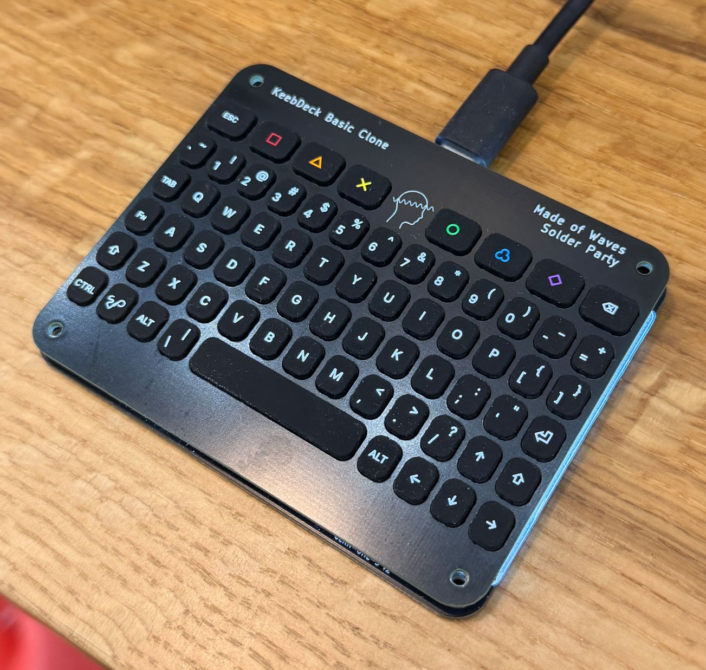

# Made of Waves — KeebDeck Basic (QMK + VIA)

This repository contains the **Made of Waves** configuration for the **KeebDeck Basic**, including:
- Updated **QMK firmware** sources
- A matching **VIA layout definition** (JSON) for easy remapping

## Credit (Important 🧡)

The **KeebDeck Basic** hardware and the original QMK keyboard definition are by **Solder Party**.

This repo is a **derivative configuration** (custom layout + VIA definition + firmware tweaks) built on top of Solder Party's work and the broader QMK ecosystem.

- Original creator / maintainer: **Solder Party**  
- Solder Party GitHub: https://github.com/solderparty  
- QMK Firmware: https://github.com/qmk/qmk_firmware  

If you're looking for the original upstream keyboard project and documentation, please start with Solder Party.

---

## What's in this repo?

- `keebdeck_basic/`  
  QMK keyboard definition + keymaps used by Made of Waves.
- `keebdeck_basic/keymaps/default/`  
  Standard "non-VIA" build target.
- `keebdeck_basic/keymaps/via/`  
  VIA-enabled build target (keymap is identical to `default`, the difference is build flags).
- `via/keebdeck_basic_via.json`  
  VIA definition JSON (layout sizing + matrix positions) for loading into the VIA app.

---

## Building the firmware

After setting up your QMK build environment, navigate to the directory where you downloaded /keebdeck_basic:

- Build the default (non-VIA) keymap:

qmk compile -kb madeofwaves/keebdeck_basic -km default

- Build the VIA-enabled keymap:

qmk compile -kb madeofwaves/keebdeck_basic -km via

If you prefer the classic make syntax:

make madeofwaves/keebdeck_basic:default
make madeofwaves/keebdeck_basic:via

See:
- QMK build tools setup: https://docs.qmk.fm/#/getting_started_build_tools
- QMK make guide: https://docs.qmk.fm/#/getting_started_make_guide
- New to QMK? https://https://doc.qmk.fm/#/newbs

---

## Flashing
Example flashing commands:

qmk flash -kb madeofwaves/keebdeck_basic -km default
qmk flash -kb madeofwaves/keebdeck_basic -km via

Or using make:

make madeofwaves/keebdeck_basic:default:flash
make madeofwaves/keebdeck_basic:via:flash

## Via Setup
This keyboard uses a custom VIA definition file.

Open VIA

Go to Settings and enable Show Design tab

Go to Design → Load and select:

via/keebdeck_basic_via.json

After loading, you should see the Made of Waves layout and be able to remap keys.

Bootloader

Enter the bootloader in any of these ways:

Bootmagic reset: Hold the [Esc] key while plugging in USB
or
Physical reset: Press the reset button on the back of the PCB labeled "Boot"
or
Keycode reset: Use a key mapped to QK_BOOT (if present)

## License

This project contains firmware sources derived from **QMK Firmware**, which is licensed under the **GNU General Public License v2.0 (GPL-2.0)**.

Accordingly:

- All QMK-derived source files in this repository are provided under the terms of the GPL-2.0.
- Any redistribution or modification of those files must comply with the GPL-2.0 license.

---

### Upstream work

The original **KeebDeck Basic** hardware design and upstream QMK keyboard definition were created by **Solder Party**.

This repository is a **derivative hardware and firmware adaptation** built on top of Solder Party’s original work and the QMK ecosystem.  
All original copyrights and attributions are retained where applicable.

---

### Made of Waves additions

Original contributions in this repository by **Made of Waves** (including firmware modifications, configuration, documentation, and layout definitions) are released for **free use**, modification, and redistribution, provided that:

- Proper attribution is maintained
- Upstream license requirements (including GPL-2.0 for QMK-derived code) are respected

No warranty is provided. Use at your own risk.